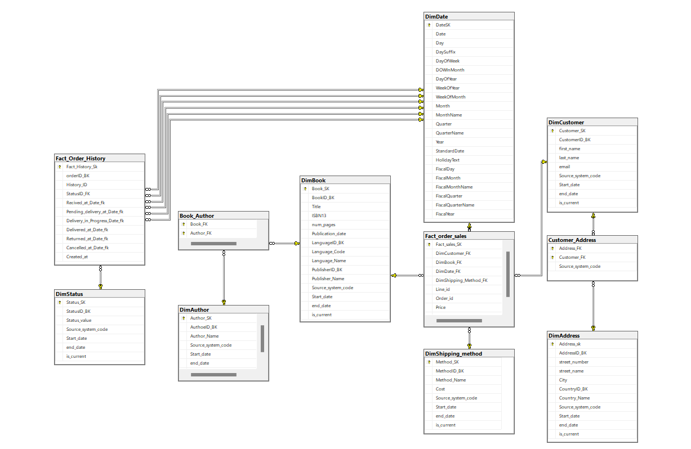
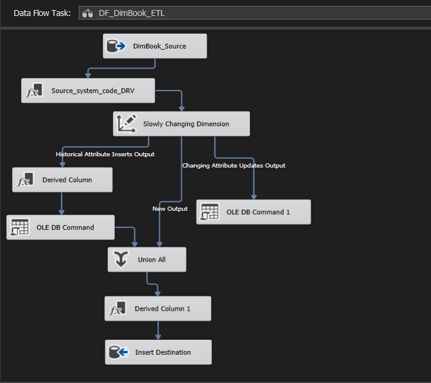
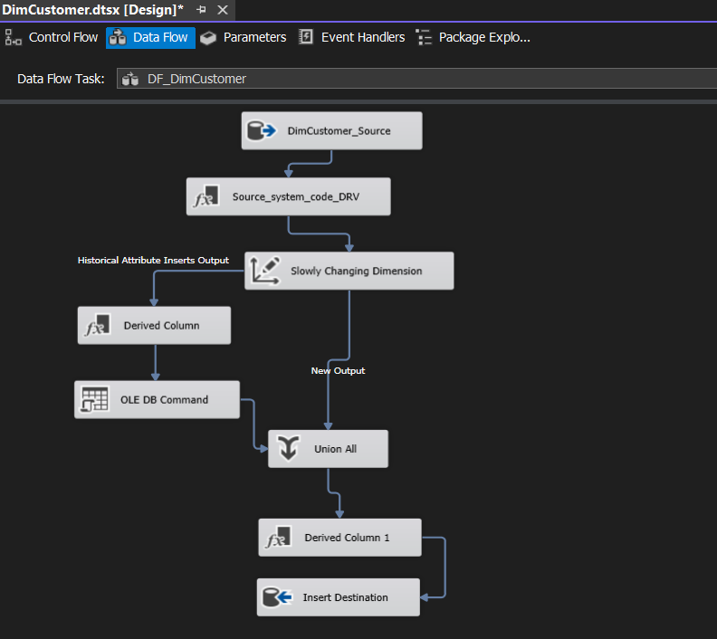
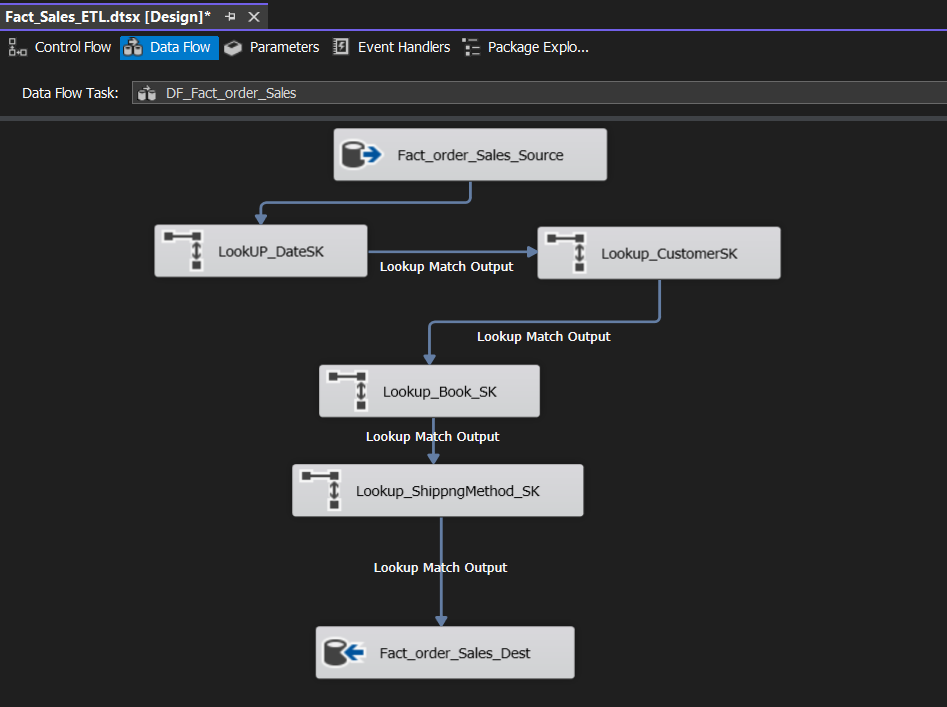
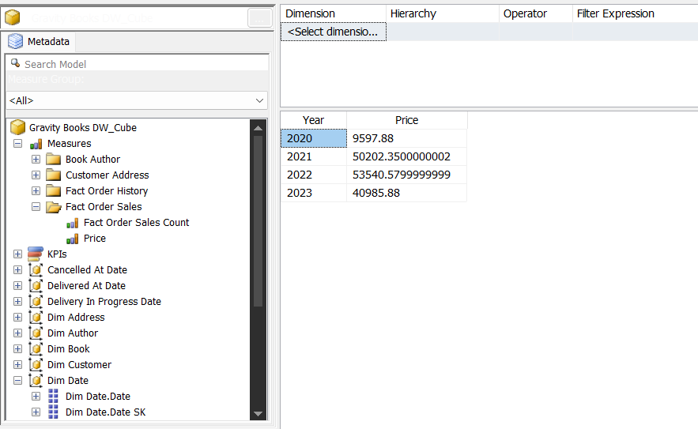
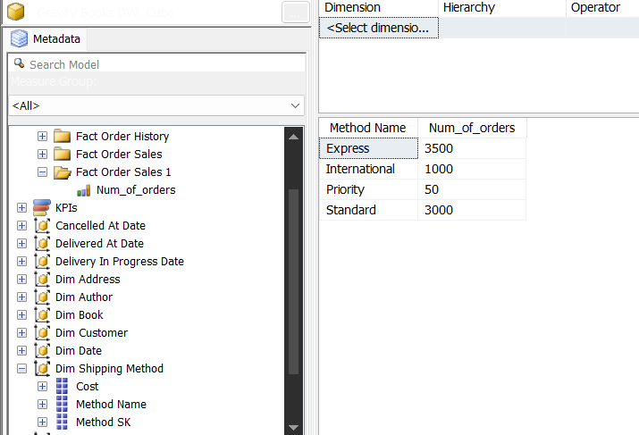
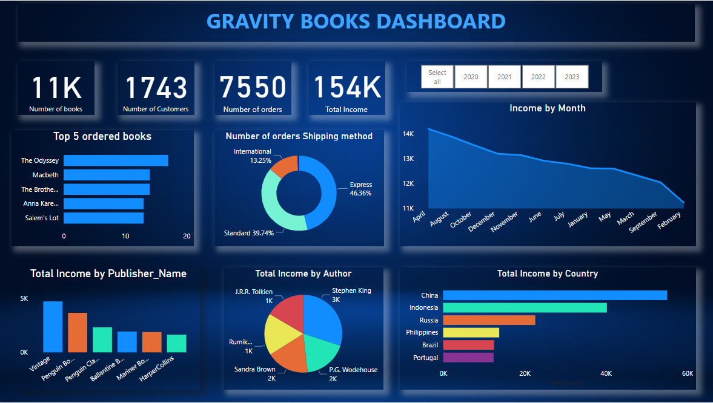

<!DOCTYPE html>
<html lang="en">

<head>
  <meta charset="UTF-8">
  <meta name="viewport" content="width=device-width, initial-scale=1.0">
  <title>Gravity Books Data Warehouse</title>
</head>

<body>

  <h1>Gravity Books Data Warehouse</h1>

  
<strong>Gravity Books Data Warehouse</strong> is a comprehensive project that involves the creation of a data warehouse
    for managing and analyzing book-related data using Microsoft SQL Server technologies.

  <h2>Table of Contents</h2>
  <ul>
    <li><a href="#introduction">Introduction</a></li>
    <li><a href="#datawarehouse-schema">Datawarehouse Schema</a></li>
    <li><a href="#implementation">Implementation</a>
      <ul>
        <li><a href="#ssms">SSMS</a></li>
        <li><a href="#ssis">SSIS</a></li>
        <li><a href="#ssas">SSAS</a></li>
        <li><a href="#power-bi">Power BI</a></li>
      </ul>
    </li>
    <li><a href="#installation">Installation</a></li>
  
  </ul>

  <h2>Introduction</h2>

  
The <strong>Gravity Books Data Warehouse</strong> project aims to provide a robust and efficient solution for managing
    book-related data. It incorporates a Snowflake schema, utilizes SQL Server Management Studio (SSMS) for implementation,
    employs Slowly Changing Dimension (SCD) techniques in the Dimensions' ETL using SQL Server Integration Services (SSIS),
    performs analysis through SQL Server Analysis Services (SSAS), and creates insightful dashboards using Power BI.

  <h2>Datawarehouse Schema</h2>

  
The Snowflake schema used in this project provides a structured and normalized approach to organizing the data.

  

  <h2>Implementation</h2>

  <h3>SSMS</h3>

  
The implementation of the data warehouse schema is carried out using SQL Server Management Studio (SSMS). All scripts
    and queries can be found in the <a href="DDL&DMl_Queries/">SQL Scripts</a> directory.

  <h3>SSIS</h3>

  
SQL Server Integration Services (SSIS) is employed for Extract, Transform, Load (ETL) processes. Special emphasis is
    given to implementing Slowly Changing Dimension (SCD) techniques for maintaining historical data in dimensions.

  <figcaption>SSIS Package - Dim_Book_ETL</figcaption>
  
  
  <figcaption>SSIS Package - Dim_Customer ETL</figcaption>
  
  
  <figcaption>SSIS Package - Fact_order_Sales ETL</figcaption>
  
  

  <h3>SSAS</h3>

  
SQL Server Analysis Services (SSAS) is utilized for multidimensional analysis, providing a deeper insight into the
    book-related data.

  

  
  &nbsp;&nbsp;&nbsp;
  

  <h3>Power BI</h3>

  
Power BI is used to create interactive and visually appealing dashboards for the Gravity Books Data Warehouse. A
    sample dashboard can be found in the <a href="Gravity_Books_Dashboard/">Power BI Dashboard</a> directory.

    
  

  <h2>Installation</h2>

  
To set up the project locally, follow these steps:

<ol>
  <li> Clone the repository:</li>
  <pre><code>git clone https://github.com/your-username/gravity-books-data-warehouse.git</code></pre>
  <li>Execute the SQL scripts in the <a href="DDL&DMl_Queries/">SQL Scripts</a> directory using SSMS to create the data
      warehouse schema. </li>
  <li>Set up SSIS packages by importing and configuring the packages in the <a href="Gravity_Books_DWH_ETL_SSIS/">SSIS
        Packages</a> directory.</li>
  <li>Deploy and process SSAS cubes using in the <a href="Gravity_Books_analysis_With_SSAS/">SSAS
        Cube</a> directory.</li>
  <li>Open the Power BI Dashboard file in <a href="Gravity_Books_Dashboard/">Power BI Dashboard</a> and configure the data
      sources.</li>
</ol>

</body>

</html>
